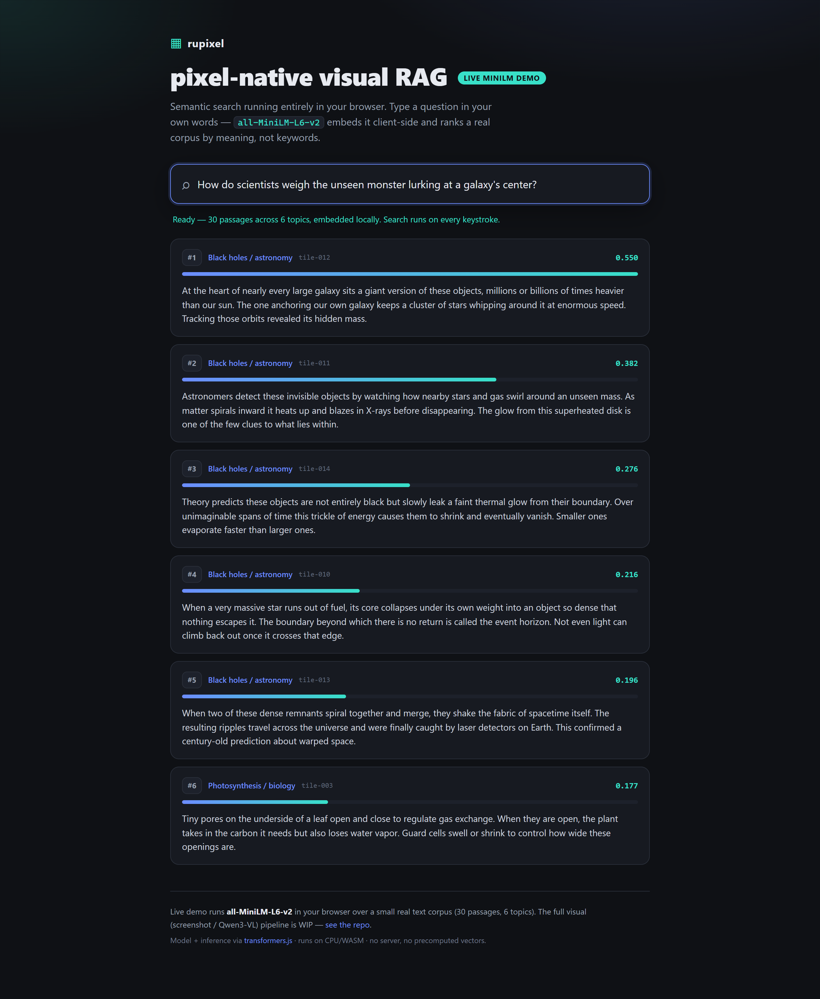

# rupixel — pixel-native visual RAG, ported to Rust on ruvector

> **Retrieve over what a page *looks like*, not just its text.** `rupixel` is an
> early-stage **Rust port of [PixelRAG](https://github.com/StarTrail-org/PixelRAG)**
> — visual / pixel-native **retrieval-augmented generation** — layered on the
> [ruvector](https://github.com/ruvnet/ruvector) approximate-nearest-neighbor
> substrate (HNSW + IVF-Flat), with a [metaharness](https://www.npmjs.com/package/@metaharness/darwin)
> benchmark + evolution CLI.

[](https://www.npmjs.com/package/rupixel)
[](./LICENSE)
[-orange.svg)](#project-status)

`rupixel` renders documents — web pages, PDFs, images — to **screenshot tiles**
and retrieves over **visual embeddings**, so tables, charts, and layout survive
retrieval instead of being flattened by an HTML/PDF text parser. It's the
"screenshot the page and search the picture" approach (à la ColPali / visual
document retrieval), implemented in Rust for throughput and small footprint.

```bash
npx rupixel            # what it is, status, links
npx rupixel doctor     # check your environment + harness
npx rupixel bench verify
```

---

## Live demo — semantic search in your browser

**▶ [ruvnet.github.io/rupixel](https://ruvnet.github.io/rupixel/)** — runs
`all-MiniLM-L6-v2` **client-side via WASM** (no server, no precomputed vectors)
and ranks a real corpus by *meaning*. Type a question in your own words.

[](https://ruvnet.github.io/rupixel/)

> The query above — *"How do scientists weigh the unseen monster lurking at a
> galaxy's center?"* — never says "black hole", yet the model retrieves all five
> black-hole passages first. That's semantic retrieval, not keyword match.

---

## Project status

**This is an honest work-in-progress, not a finished product.** Read this before
you judge the numbers:

| Area | State |
|---|---|
| Rust crate scaffold (`core`/`encoder`/`render`/`serve`/`cli`) | ✅ builds in the ruvector workspace |
| Index pipeline (tile → embed → index → search) | ✅ runs end-to-end |
| ANN backends | ✅ **HNSW** + **IVF-Flat** (real `ruvector` backends) |
| **Text embedder** | ✅ **real `all-MiniLM-L6-v2`** (sentence-transformers, WASM/CPU sidecar) |
| Benchmark harness (metaharness/darwin) | ✅ wired + verifiable |
| Eval | ✅ real semantic eval (30 passages / 6 topics / 12 paraphrase queries) |
| Live in-browser demo | ✅ MiniLM via WASM on GitHub Pages |

Everything listed ships as **working code** — no `unimplemented!()` stubs. The
*visual* path below is described as **roadmap**, not shipped placeholder code:

- **Visual encoder** (`Qwen3-VL-Embedding-2B` over rendered screenshots) and
  **document rendering** (headless-chrome / PDF) are **not implemented** — they
  need model weights + GPU and are tracked as future work, not stubbed in the repo.

> ✅ **Embeddings are now real and semantic.** Retrieval runs on real
> `all-MiniLM-L6-v2` vectors over a small but real multi-topic eval set — the
> demo above and the Rust bench use the same model.
> ⏳ **Still honest about scope:** this is **text-semantic** retrieval. The full
> *visual* PixelRAG path — rendering pages to screenshots and embedding them with
> Qwen3-VL — remains GPU-gated and WIP. We won't quote a *visual* recall number we
> haven't earned.

---

## Why pixel-native RAG?

Traditional RAG parses a document to text first, which **loses visual structure** —
multi-column layout, tables, charts, figures, stamps, handwriting. Pixel-native
RAG skips parsing: it renders each page to image tiles and embeds the *pixels*,
so the retriever sees the document the way a human does. Upstream PixelRAG ships a
pre-built index of **8.28M Wikipedia pages** and even accepts an **image as the
query**.

`rupixel` brings that pipeline to Rust on `ruvector`, aiming for production-grade
throughput and memory, with the index swappable between `ruvector` backends.

---

## Quickstart (`npx rupixel`)

The CLI needs only Node ≥ 18 and network access (it wraps `@metaharness/darwin`):

```bash
# project status + architecture + links
npx rupixel info

# environment check (node + darwin + bench suite)
npx rupixel doctor

# (re)generate and verify the darwin benchmark suite
npx rupixel bench create
npx rupixel bench verify

# evolve the harness toward the best (recall × memory) Pareto frontier
#   — meaningful once a real encoder + real-scale corpus are wired (see Roadmap)
npx rupixel evolve --generations 20 --children 12 --seed 42
```

`rupixel` is a thin, dependency-free wrapper. It does **not** compile Rust for
you — the Rust port builds inside the ruvector monorepo (see
[`rust/README.md`](./rust/README.md)).

---

## How it works

```
tiles (text/render) ──embed──▶ vectors ──index──▶ ruvector ANN (HNSW | IVF-Flat)
                       (MiniLM)                              │
query ──embed──▶ vector ──────────search──────────────▶ top-k tiles ──▶ reader/LLM
```

- **Embed** (`pixelrag-encoder`): real **`all-MiniLM-L6-v2`** sentence embeddings
  via a WASM/CPU sidecar (no GPU). *Roadmap:* `Qwen3-VL-Embedding-2B` visual
  encoding over rendered screenshots.
- **Index/Search** (`pixelrag-core`): adaptor over `ruvector` — **HNSW**
  (`ruvector-core`) or **IVF-Flat** (`ruvector-rairs`), selectable at runtime.

### Crates (all shipped, no stubs)

| Crate | Role |
|---|---|
| `pixelrag-core` | pipeline + tile logic + ANN index adaptor (HNSW / IVF-Flat) |
| `pixelrag-encoder` | real `all-MiniLM-L6-v2` embedder (WASM/CPU sidecar) |
| `pixelrag-cli` | benchmark harness (recall/ndcg/mrr + latency/build/memory) |

---

## Benchmark harness (metaharness / darwin)

The benchmark suite is **darwin-generated** (`.metaharness/bench.json`) and
integrity-checked — `npx rupixel bench verify` recomputes its `taskHash`. The
harness exposes the optimizable surface (index backend, batch size, cache size)
so `darwin evolve` can search a **Pareto frontier** of `(recall × memory × latency)`.

It is a **removable augmentation** — the Rust port builds, indexes, and searches
with no darwin dependency at runtime. See [`docs/BENCH.md`](./docs/BENCH.md).

**Measured run** — real `all-MiniLM-L6-v2` embeddings (HNSW backend) over the
real eval fixture (30 passages / 6 topics / 12 paraphrase queries):

| metric | value |
|---|---|
| recall@10 | 1.00 |
| ndcg@10 | 0.96 |
| mrr | 1.00 |
| search latency p50 | ~1.0 ms |

*Honest reading: the 6 topics are cleanly separated, so recall/mrr saturate —
`ndcg@10 = 0.96` is the signal, reflecting real (imperfect) ranking. This is a
small, easy **real** eval, not a hard benchmark. Reproduce with*
`cargo run -p pixelrag-cli -- benchmark … --embedder real`.

The benchmark also runs under both ANN backends (`--index-backend hnsw|ivf-flat`)
so `darwin evolve` has a real `(quality × memory × latency)` surface to optimize.

---

## Roadmap

**Shipped (working code, no stubs):** real MiniLM semantic embedder, HNSW +
IVF-Flat index, runnable benchmark harness, live in-browser demo.

**Next (not yet implemented — tracked, not stubbed):**
- Visual encoding: render pages to screenshots + embed with `Qwen3-VL-Embedding-2B`
  (needs model weights + GPU).
- Larger, harder corpus for a meaningful recall frontier.

Full design + acceptance criteria in
[`docs/ADR-264-pixelrag-rust-port-on-ruvector.md`](./docs/ADR-264-pixelrag-rust-port-on-ruvector.md).

---

## Building the Rust port

The crates use `ruvector` path dependencies, so they build inside the ruvector
monorepo (or via the `external/rupixel` submodule), **not** standalone:

```bash
# from a ruvector checkout that includes these crates
cargo build -p pixelrag-core -p pixelrag-cli

# real MiniLM embeddings need the one-time sidecar install:
( cd crates/pixelrag-cli/sidecar && npm install )

cargo run -p pixelrag-cli -- benchmark \
  --ground-truth tests/fixtures/pixelrag/ground-truth.json \
  --queries tests/fixtures/pixelrag/queries.json \
  --metrics ndcg,mrr,recall@10 \
  --embedder real --index-backend hnsw
```

See [`rust/README.md`](./rust/README.md) for details.

---

## Credits & license

- **Upstream:** [StarTrail-org/PixelRAG](https://github.com/StarTrail-org/PixelRAG)
  (Apache-2.0) — the visual-RAG approach this project ports. `rupixel` is an
  independent Rust reimplementation on `ruvector`; all code here is original.
- **Substrate:** [ruvnet/ruvector](https://github.com/ruvnet/ruvector) — ANN
  indexes (HNSW, IVF-Flat) and the broader vector platform.
- **Harness:** [@metaharness/darwin](https://www.npmjs.com/package/@metaharness/darwin).

Licensed under [MIT](./LICENSE).
