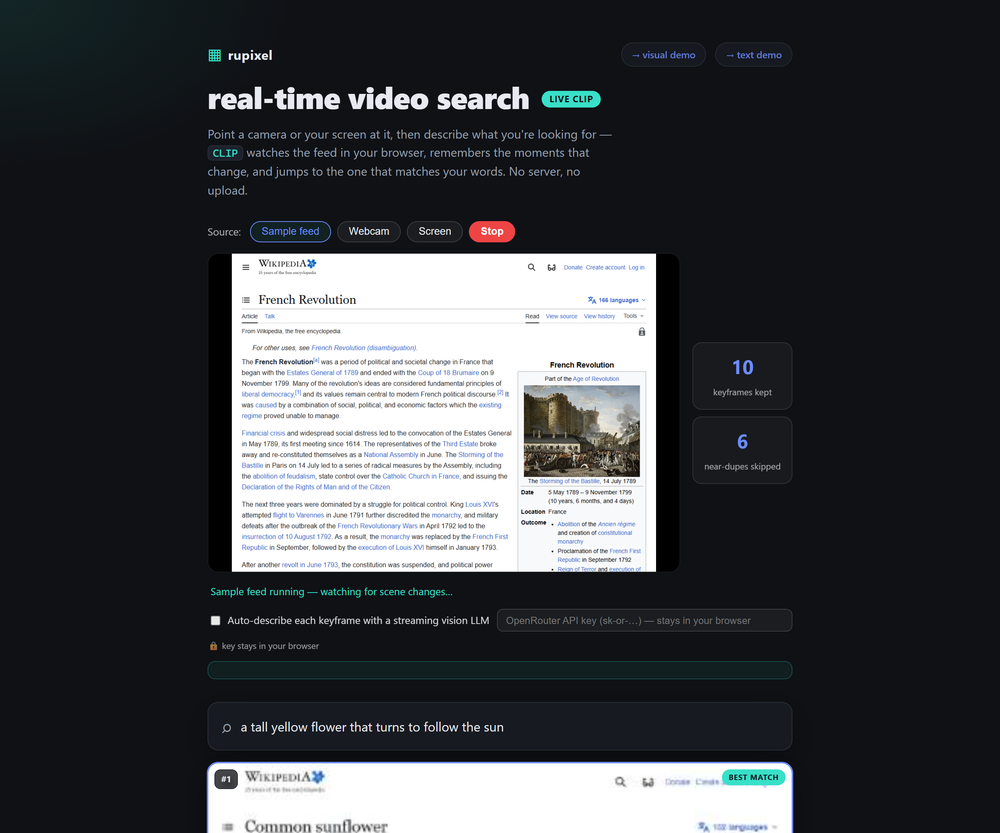
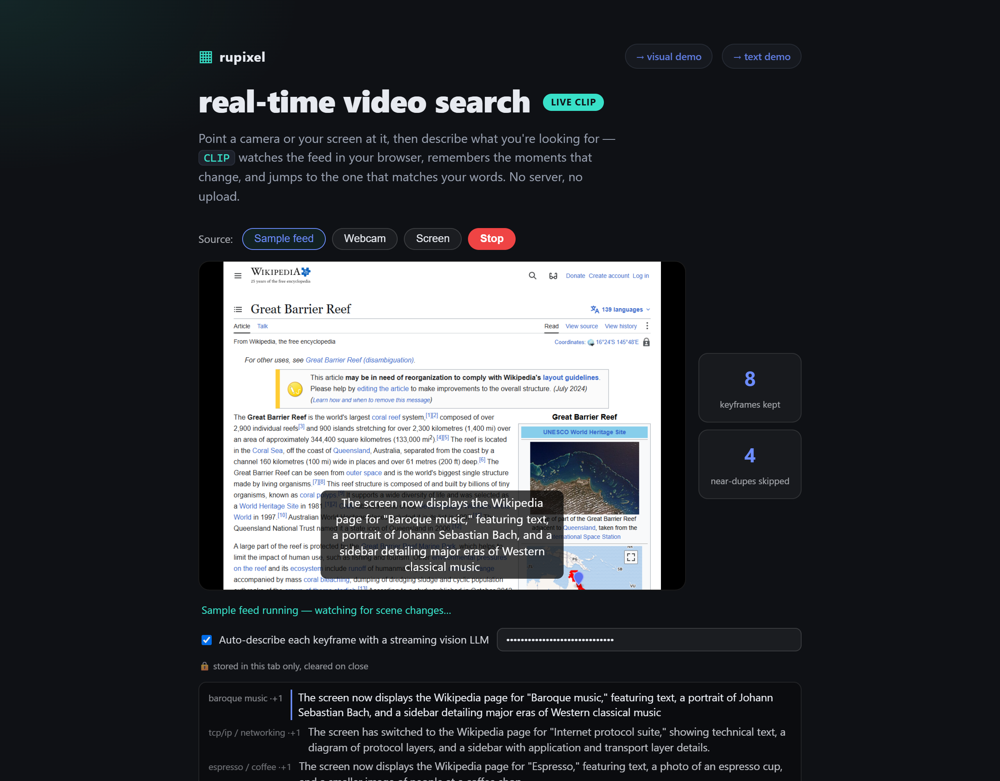

# rupixel — search documents by *meaning*, including pictures of pages

[](https://www.npmjs.com/package/rupixel)
[](./LICENSE)
[-orange.svg)](#how-finished-is-this)

**rupixel finds the documents that match what you *mean*, not just the words you typed.**
You can search a pile of documents two ways:

1. **By their text** — the classic approach.
2. **By how the page *looks*** — rupixel takes a **screenshot of each page** and
   searches the pictures. That matters when the text is locked inside a scan, an
   image, a table, or a chart that ordinary text search can't read.

Try it right now — all run **entirely in your browser**, no install, no server:

- **▶ Real-time video search:** https://ruvnet.github.io/rupixel/live.html
  — point a camera/screen at it, type what you're looking for, jump to the moment.
- **▶ Visual search:** https://ruvnet.github.io/rupixel/visual.html
- **▶ Text search:** https://ruvnet.github.io/rupixel/

[](https://ruvnet.github.io/rupixel/live.html)

### Real-time video search (live)

A live feed (sample clip / webcam / screen) is sampled a few times a second.
Frames that barely changed are **skipped** (a "keyframe gate"); the rest are
embedded with CLIP so you can search the stream by meaning. Highlights:

- **Runs on your GPU when available** (WebGPU via transformers.js v3), falling back
  to CPU/WASM automatically — so frame embedding is fast enough to feel live.
- **Runs on your GPU when available** (WebGPU via transformers.js v3), falling back
  to CPU/WASM automatically.
- **Optional live captions (like closed captions).** A streaming vision LLM
  (default **Qwen3-VL**, a recent, low-cost Chinese vision model) narrates each
  keyframe word-by-word: the current line shows as a **subtitle over the video**,
  and every line is kept in a **timestamped transcript** below it.
- **Built for motion.** When lots changes at once, it doesn't flood — it describes
  only the **latest settled frame** (skipping the in-between ones, shown as `·+N`)
  and feeds the **previous caption as context**, so the captions narrate *what
  changed* ("the screen has switched to…") instead of restarting each time.
- **Your API key is handled safely.** The public demo is **bring-your-own-key**:
  your OpenRouter key is stored only in your browser tab (`sessionStorage`,
  cleared when you close it), sent only to OpenRouter, never uploaded here or
  committed. For a shared/managed key, run the included **server-side proxy**
  (`describe-proxy.mjs`) that reads the key from an environment variable and paste
  the proxy's URL instead — the key then never reaches the browser at all.

[](https://ruvnet.github.io/rupixel/live.html)

Design details: [ADR-265](docs/adr/ADR-265-real-time-video-visual-rag-rupixel.md)
(pipeline), [ADR-266](docs/adr/ADR-266-midstream-streaming-frame-ingestion.md)
(MidStream scale tier + the key-security proxy),
[ADR-267](docs/adr/ADR-267-photonlayer-optical-front-end-video-frames.md)
(experimental optical front-end).

> In the demo above, the question *"the unseen monster lurking at a galaxy's center"*
> brings back the **black-hole** page — even though the question never says the
> words "black hole." That's searching by **meaning**.

---

## A 30-second explainer (no jargon)

- **Searching by meaning.** A computer can't compare meanings directly, so each
  document is turned into a long list of numbers that captures *what it's about*.
  Things that mean similar things get similar numbers. To search, we turn your
  question into numbers the same way and find the documents whose numbers are
  closest. (The technical name for "meaning as numbers" is an **embedding**.)
- **Two translators do this:**
  - **Text → numbers:** a small, fast model called **MiniLM**.
  - **Picture → numbers** *and* **text → numbers, in the same number-space:** a
    model called **CLIP**. Because CLIP puts pictures and words in the *same*
    space, you can type words and get back **images** — that's the visual search.
- **It's fast and private.** The models are small enough to run on a normal CPU,
  right inside your browser tab. Nothing is uploaded.
- **What the numbers in the demo mean.** Each result shows a score like `0.27`.
  That's a **similarity score** (how close the meanings are — higher is a better
  match), **not** a time. Speed is reported separately, in **milliseconds**.

This idea — "search the *picture* of the page" — comes from a project called
[PixelRAG](https://github.com/StarTrail-org/PixelRAG). rupixel is a fresh
re-build of it in the **Rust** language, on top of
[ruvector](https://github.com/ruvnet/ruvector) (a fast engine for storing and
searching those number-lists).

> **"RAG"?** It stands for *Retrieval-Augmented Generation*: first **find** the
> documents relevant to a question, then hand them to an AI to write the answer.
> rupixel is the **"find"** half — the search engine, not the answer-writer.

---

## How well does it work?

We tested it on **8 real Wikipedia pages** (black holes, the French Revolution,
photosynthesis, espresso, TCP/IP, baroque music, sunflowers, the Great Barrier
Reef) using **8 questions** phrased in everyday words that *don't* reuse the
page's vocabulary — so it can only succeed by understanding meaning.

| How we searched | Got the right page #1 | Speed per search |
|---|---|---|
| **By text** (MiniLM reads the words) | **8 out of 8** | ~0.6 ms |
| **By picture** (CLIP looks at the screenshot) | **8 out of 8**\* | ~0.5 ms |

\* 8/8 when run on the desktop/Rust side. The in-browser version gets **7 out of 8**
(it draws the images slightly differently, which flips one near-tie: "a coral
ecosystem" puts the reef page 2nd behind the photosynthesis page — both are green
nature scenes).

**The honest takeaway:** these 8 pages are *easy* — clean text, clearly different
topics — so **both** methods ace it and the test can't really tell them apart.
The point of visual search shows up on the *hard* stuff that text search chokes
on: scanned paper, screenshots, complex layouts, tables and charts. That harder
test is the next thing to build. Also, **CLIP is a modest, free, CPU-friendly
"eyes" model** — a stronger one (like Qwen3-VL or ColPali) would do better, but
needs a graphics card (GPU). Full details and how to reproduce these numbers:
**[docs/BENCHMARK.md](./docs/BENCHMARK.md)**.

---

## Try the command-line tool

```bash
npx rupixel            # what it is + links
npx rupixel doctor     # check your setup
```

`npx rupixel` is a tiny helper (no install needed beyond Node 18+). It explains
the project and runs the benchmark harness. It does **not** compile the Rust code
for you — see ["Run it yourself"](#run-it-yourself) for that.

---

## How finished is this?

**Early-stage, but everything described here actually runs — there is no fake or
placeholder code.** What works today:

- ✅ **Text search** with a real model (MiniLM).
- ✅ **Visual search** with a real model (CLIP) over real page screenshots.
- ✅ **Page rendering** (turning a web page or PDF into a screenshot) using a real
  headless browser.
- ✅ **Two live in-browser demos** + a reproducible benchmark.

What's **not** done yet (and is honestly described as future work, not faked):

- A **stronger visual model** (Qwen3-VL / ColPali) for sharper results — needs a GPU.
- A **bigger, harder test set** (scans, tables, charts) to really show where
  visual search beats text search.

---

## What's inside (for developers)

The pipeline is simple: **turn each page into numbers → store them → find the
closest ones to your query.**

```
page  →  (text or screenshot)  →  numbers (MiniLM / CLIP)  →  stored in ruvector
your question  →  numbers  →  find the closest pages  →  ranked results
```

Three small Rust packages, all real code:

| Package | What it does |
|---|---|
| `pixelrag-core` | the pipeline + storing/searching the number-lists (via ruvector) |
| `pixelrag-encoder` | turns text/images into number-lists (MiniLM / CLIP) |
| `pixelrag-cli` | runs the benchmarks and prints accuracy + speed |

The models run via small **Node.js helper scripts** ("sidecars") so they work on
a plain CPU with no special setup. Storage and search use two interchangeable
indexing methods from ruvector (you can switch between them to trade memory for
speed).

> There's also an optional, **completely removable** tuning tool
> ([metaharness/darwin](https://www.npmjs.com/package/@metaharness/darwin)) that
> can automatically search for the fastest/most-accurate settings. The project
> works fine without it — details in [docs/BENCH.md](./docs/BENCH.md).

---

## Run it yourself

The Rust code lives inside the [ruvector](https://github.com/ruvnet/ruvector)
project (it reuses ruvector's search engine), so build it from a ruvector checkout:

```bash
# one-time: install the small model helpers
( cd crates/pixelrag-cli/sidecar && npm install )

# build
cargo build -p pixelrag-core -p pixelrag-cli

# search by text (MiniLM)
cargo run -p pixelrag-cli -- benchmark --mode text  --embedder real \
  --ground-truth tests/fixtures/pixelrag/compare/text/ground-truth.json \
  --queries      tests/fixtures/pixelrag/compare/text/queries.json \
  --tiles        tests/fixtures/pixelrag/compare/text/tiles \
  --metrics ndcg,mrr,recall@10

# search by picture (CLIP, over the page screenshots)
cargo run -p pixelrag-cli -- benchmark --mode visual
```

More detail in [`rust/README.md`](./rust/README.md).

---

## Credits & license

- **The idea:** [StarTrail-org/PixelRAG](https://github.com/StarTrail-org/PixelRAG)
  (Apache-2.0) — searching pages as pictures. rupixel is an independent Rust
  rebuild; all code here is original.
- **The search engine:** [ruvnet/ruvector](https://github.com/ruvnet/ruvector).
- **The models:** MiniLM and CLIP, run in-browser/on-CPU via
  [transformers.js](https://github.com/xenova/transformers.js).
- **Optional tuner:** [@metaharness/darwin](https://www.npmjs.com/package/@metaharness/darwin).

Licensed under [MIT](./LICENSE).
